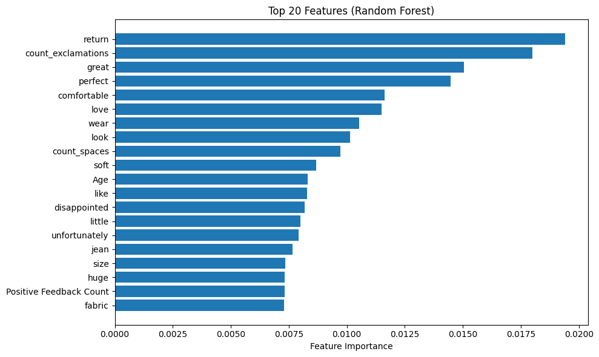
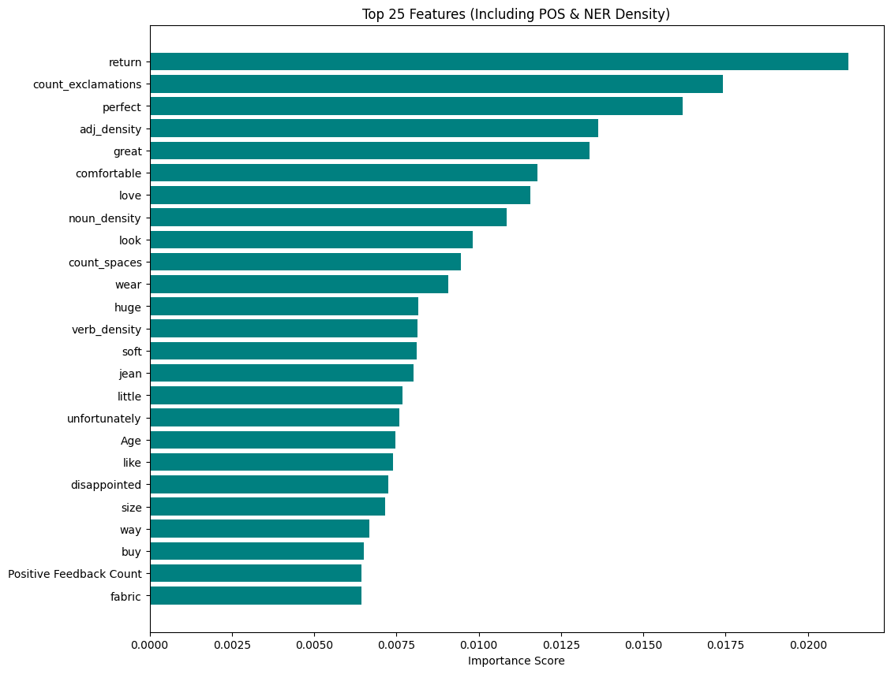

# Customer Review Recommendation Pipeline

A machine learning pipeline that predicts whether a customer recommends a product based on their written review and other attributes.

## Overview

This project builds an end-to-end sklearn pipeline that handles numerical, categorical, and text features to classify customer reviews as recommended (`1`) or not recommended (`0`). The pipeline includes custom NLP preprocessing, TF-IDF vectorization, and a tuned Random Forest classifier.

## Dataset

The dataset (`reviews.csv`) contains anonymized women's clothing reviews with 8 features:

| Feature | Type | Description |
|---|---|---|
| Clothing ID | Categorical | Identifier for the product being reviewed |
| Age | Numerical | Age of the reviewer |
| Title | Text | Short title of the review |
| Review Text | Text | Full body of the review |
| Positive Feedback Count | Numerical | Number of customers who found the review helpful |
| Division Name | Categorical | High-level product division |
| Department Name | Categorical | Product department |
| Class Name | Categorical | Product class |

**Target:** `Recommended IND` — `1` if the customer recommends the product, `0` if not.

## Project Structure

```
├── starter.ipynb       # Main notebook
├── reviews.csv         # Dataset
└── README.md
```

## Pipeline Architecture

The pipeline is built with sklearn's `ColumnTransformer` to handle each feature type separately before feeding into a classifier.

### Feature Groups

- **Numerical** (`Age`, `Positive Feedback Count`): mean imputation → standard scaling
- **Categorical** (`Division Name`, `Department Name`, `Class Name`): most-frequent imputation → one-hot encoding
- **Text** (`Review Text`): two parallel branches:
  - **Character counts**: counts spaces, `!`, and `?` per review using a custom `CountCharacter` transformer
  - Stylometric Densities (Advanced NLP): Uses spaCy to calculate the density of Nouns, Verbs, and Adjectives (counts normalized by review length) and total Named Entity (NER) counts. This is followed by standard scaling.
  - **TF-IDF**: spaCy lemmatization with stopword removal → TF-IDF vectorization

### Custom Transformers

- **`CountCharacter`**: counts occurrences of a given character in each review
- **`SpacyLemmatizer`**: lemmatizes text and removes stopwords using spaCy's `en_core_web_sm` model

## Requirements

```
scikit-learn
pandas
numpy
scipy
spacy
```

Install spaCy and download the English model:

```bash
pip install spacy
python -m spacy download en_core_web_sm
```

## Usage

Run the notebook cells top to bottom. The key steps are:

1. Load and explore `reviews.csv`
2. Split into train (90%) / test (10%) with `random_state=27`
3. Build feature pipelines and combine with `ColumnTransformer`
4. Train a `RandomForestClassifier` baseline
5. Tune with `RandomizedSearchCV` over 10 iterations, 3-fold CV, optimising for F1

## Results

| Model | Accuracy | Precision | Recall | F1 |
|---|---|---|---|---|
| Random Forest (baseline) | 0.847 | 0.849 | 0.990 | 0.914 |
| Random Forest (tuned) | 0.868 | 0.876 | 0.978 | 0.924 |
| Random Forest (with NER and POS tagging) | 0.858 | 0.867 | 0.977 | 0.919 |

Tuning improved accuracy (+2.1pp) and precision (+2.7pp) with a modest trade-off in recall, resulting in a better overall F1 score.

## Hyperparameter Search

`RandomizedSearchCV` is used to tune the following parameters across 10 iterations with 3-fold CV, optimising for F1:

- `n_estimators`: 100–300
- `max_depth`: 5, 10, 20, or None
- `max_features`: `sqrt` or `log2`
- `min_samples_split`: 2–10
- `class_weight`: None or `balanced`

**Best parameters found:**

| Parameter | Value |
|---|---|
| `class_weight` | `balanced` |
| `max_depth` | None |
| `max_features` | `sqrt` |
| `min_samples_split` | 7 |
| `n_estimators` | 133 |

## Feature Importance

The top 20 features by importance from the tuned model (without advanced NLP features):



The top 25 features by importance from the tuned model (with advanced NLP features):



Key findings:
## Without NER and POS Tagging
- **`return`** is the single strongest signal — reviews mentioning returns are very likely negative
- **`count_exclamations`** ranks #2, showing the custom `CountCharacter` transformer adds real value — exclamation marks correlate with enthusiastic positive reviews
- Positive sentiment words (`great`, `perfect`, `comfortable`, `love`) and negative ones (`disappointed`, `unfortunately`) dominate the top TF-IDF features
- **`count_spaces`** (review length) at #9 also carries signal — longer reviews tend to be more opinionated
- **`Age`** at #11 shows demographic still matters alongside text features
- Categorical features (division, department, class) do not appear in the top 20, suggesting product category is less predictive than what customers actually write

## With NER and POS Tagging:
- By implementing custom spaCy transformers, the process moved beyond simple word-counting (TF-IDF) to analyze the stylometry of reviews. 
- The results showed that Adjective Density was the 4th most important feature in the entire model, outperforming common sentiment words. 
- This suggests that the intensity and descriptiveness of a customer's language are fundamental drivers of their recommendation behavior.

## Acknowledgements
- Udacity Data Scientist Nanodegree Program
- AI Tool: Claude
